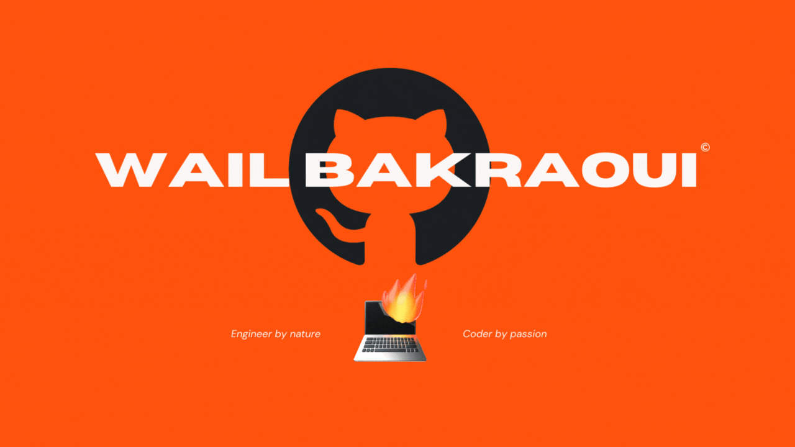

## 👋 Hey there! I'm Wail Bakraoui

* 📊 I'm a motivated Data Analyst with a passion for translating complex data into actionable insights. With a robust foundation in **IT** & **Artificial Intelligence (AI)**, I've sharpened my skills in **Python, MS Excel, , SQL, Pandas,** and **visualization tools** such as **Tableau, Matplotlib, Seaborn,** and **Power BI.**

* 🎓 My academic journey includes a **Data Analyst** Degree from Ironhack in **Amsterdam**, and a **Bachelor** dregree in rchitecture at O.D.A.B.A, Odessa, demonstrating my versatile skill set and adaptability.

* 🌍 Multilingual with professional-level proficiency in **English, French,** and **Arabic,** plus basic conversational **Dutch**, I thrive in diverse environments and bring a global perspective to my work.

* 🚀 I'm motivated, analytical, and always eager to tackle new challenges. My aspiration? It's to immerse myself in the dynamic environment of an innovative company, leveraging my data analytics skills, ability to overcome challenges, and exceptional communication to illuminate our journey toward success.
  
* 🔍 Check out my projects for a peek into my work and the value I bring to the table.

* 🔗 Let's connect and explore how we can create impact together! [My LinkedIn](https://www.linkedin.com/in/WailBak)

## 🛠 Tools I Use

